
<!-- _class: lead -->
<!-- _paginate: false -->
<!-- _header: "" -->
<!-- _footer: "Par [Mathéo Galuba](https://matheo-galuba.com) - 2024" -->

# L'informatique dans la conquête spatiale et l'astronomie

---
<!-- _class: lead -->
<!--
Pour introduire cette conférence, j'aimerai nous faire prendre à tous un peu de recul sur l'époque qu'on est en train de vivre.
En très peu de temps à l'échelle de l'histoire de l'humanité, les machines ont pris une place prépondérante dans notre quotidien. Dans l'histoire, on a inventer beaucoup de machines pour nous simplifier la vie, mais c'est vrai que l'informatique est un exemple assez unique. Notamment à cause de la vitesse à laquelle il nous a envahis et de son impact sur notre société.
-->

## Introduction :
## La puissance incontestée des machines

---

### Loi de Moore

En 1965, Gordon Moore, cofondateur d'Intel, a énoncé :

**"Le nombre de transistors dans un circuit intégré double environ tous les deux ans."**

---

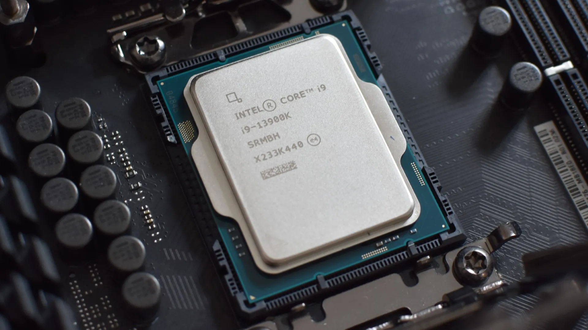

---
<!-- _class: lead -->

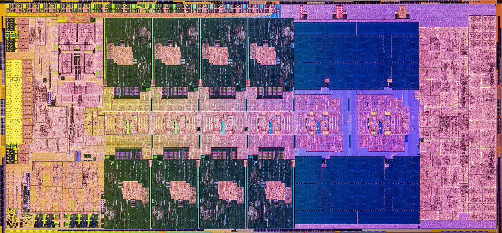

---
<!-- _class: lead -->

# 10 000 000 000 de transistors

---

<iframe src="https://dev.matheo-galuba.com/embed/moore-s-law" width="100%" height="100%" frameborder="0"></iframe>

---

## Plan

1. Informatique et astronomie
    - Observer l'Univers
    - Comprendre l'Univers
2. Informatique et exploration spatiale
    - L'histoire conjointe de l'informatique et de la course à l'espace 
    - Perspectives futures

---
<!-- _class: lead -->

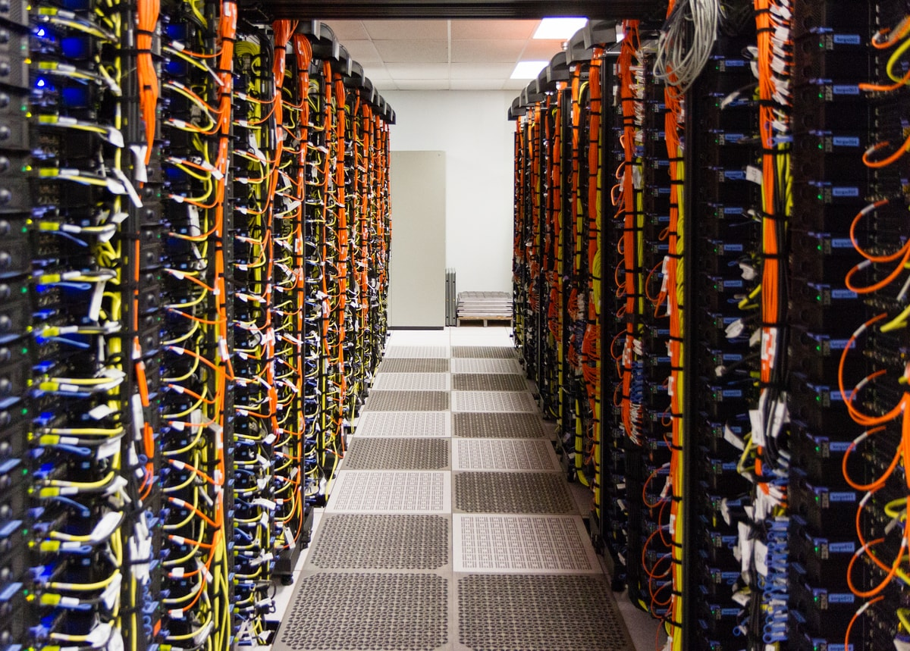

# 1. Informatique et astronomie

---
<!--
Comme toutes les sciences, l'astronomie a été révolutionnée par l'informatique.
Aujourd'hui, c'est l'une des sciences la plus génératrice et utilisatrice de données.
-->

## 1.1. Observer l'Univers

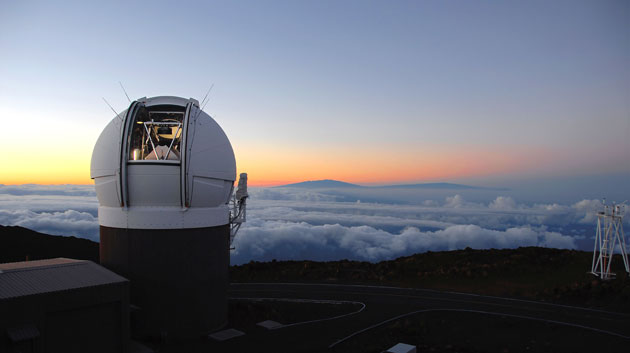

---

L'astronomie c'est :
- environ 100To/jour dans le monde
- des dizaines de Po par ans

 

- *1To = 2 000 000 de livres*
- *1To = 1000Go*
- *1Po = 1000To*

---
<!-- _class: lead -->

Le volume de données double environ tous les 2 ans.

---
<!-- _class: lead -->

"Plus ça augmente, plus ça augmente."

- Moi

---

<!-- _footer: "Hubble Ultra Deep Field" -->

<!--
Une autre facette de cette explosion de données, c'est l'augmentation de la complexité de ces données. Parce que les outils qui génèrent ces données sont de plus en plus précis, les données sont de plus en plus complexes. Exemple :
-->

<iframe src="https://esahubble.org/images/heic1502a/zoomable/" width="100%" height="100%" frameborder="0"></iframe>

<!--
Dans le centre de cette image, quasiment chaque pixel contient au moins une étoile.
Et à partir de ces étoiles, nous pouvons extraire des centaines de données différentes.
Une augmentation de la complexité induit une augmentation de la quantité de calculs à effectuer pour traiter ces données.
-->

---
<!--
En plus de la complexité des données, nous avons affaire à des données qui évoluent dans le temps. Ce qui nous intéresse, ce sont à la fois les choses "fixes" mais aussi les événements, les choses qui bougent.
Donc, on n'analyse pas l'univers à un instant T, mais un flux constant de données.
-->

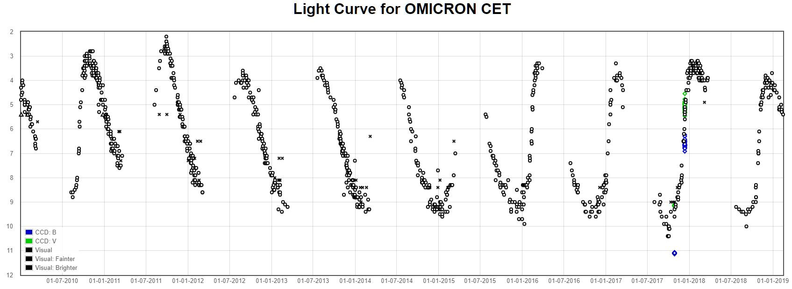

---
<!--
Avoir des To de base de données, c'est bien, mais ça ne sert à rien si on ne peut pas en extraire les connaissances.
C'est largement impossible pour des humains, donc on utilise des logiciels. Mais même les logiciels classiques ont des limites, c'est qu'ils sont créés par des humains...
La solution, c'est l'intelligence artificielle.
On utilise l'IA surtout pour classifier les données, les trier, en extraire des informations pertinentes.
Le point important, c'est que l'IA est capable de s'adapter à la complexité des données et de s'améliorer avec le temps.
Plus il y a de données, plus l'IA est performante, c'est un cercle vertueux.
-->

## Le rôle des intelligences artificielles

Données brutes, abondantes et hétérogènes vers des connaissances exploitables.

 

---

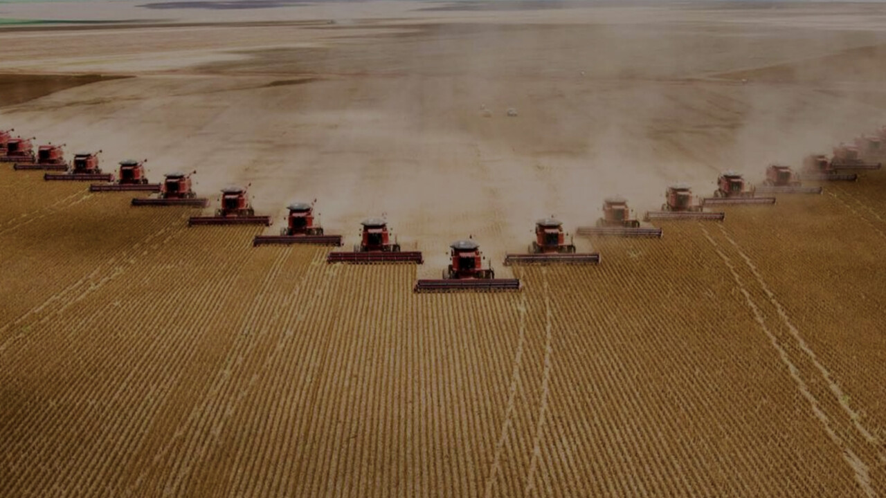

---
<!--
Donc, on est passé d'une science où l'humain était au centre à une science extrêmement informatisée, où l'humain est là pour superviser les machines et extraire les conclusions d'un volume de données qui dépasse l'entendement.
-->

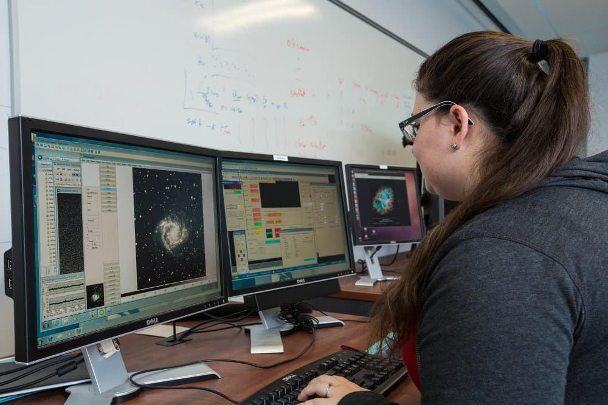

<!--
Pour finir cette partie, l'astronomie, c'est l'une des sciences la plus informatisée et automatisée qui soit. C'est aussi pour ça que la recherche en astronomie avance extrêmement vite. Donc, la méthode qui consiste à collecter des masses de données et à les traiter informatiquement est une méthode qui peut être transposée à d'autres sciences (biologie, climatologie, géologie, etc.).
-->

---
<!--
Avec toutes ces données, le défi est d'en extraire de la connaissance.
J'entends par là comprendre les phénomènes et les lois qui régissent l'univers.
-->

## 1.2. Comprendre l'univers

---
<!--
Depuis des siècles, en science, on utilise la méthode scientifique.
C'est-à-dire qu'on émet des hypothèses pour tenter de répondre à une question scientifique. Puis, on valide ou invalide ces hypothèses par l'expérience jusqu'à ce que la théorie colle à la réalité.
-->

### La méthode scientifique

 

  
  <svg xmlns="http://www.w3.org/2000/svg" width="128" height="96" viewBox="0 0 24 24" fill="none" stroke="currentColor" stroke-width="2" stroke-linecap="round" stroke-linejoin="round" class="lucide lucide-arrow-right-left"><path d="m16 3 4 4-4 4"/><path d="M20 7H4"/><path d="m8 21-4-4 4-4"/><path d="M4 17h16"/></svg>
  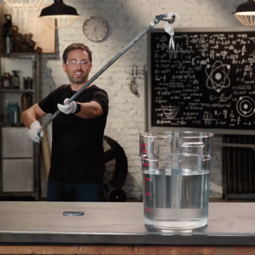

---
<!-- _class: lead -->

<!--
Grâce à cette méthode, on a pu comprendre pas mal de choses sur les lois fondamentales de l'univers.
-->

---

<!-- _footer: "Galaxy d'Andromède (Photo Orion)" -->

<!--
Mais cette méthode à ses limites. Par ce que quand on parle d'étoiles, de trous noirs, de galaxies, etc. On n'a pas de formules. 
-->

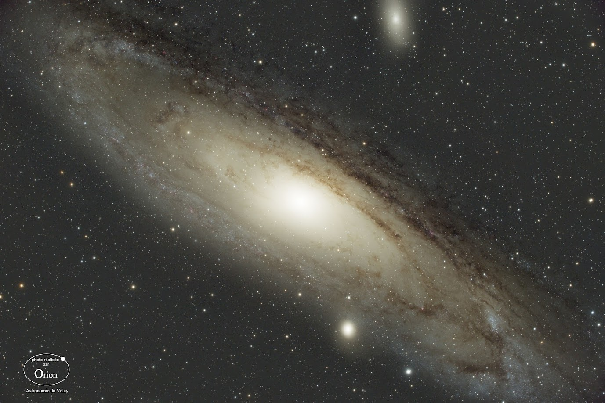

---
<!--
Donc, aujourd'hui, on utilise l'informatique pour créer des clones numériques de galaxies, d'étoiles, de systèmes solaires, etc. Et on utilise ces clones pour faire des expériences virtuelles en contrôlant tous les paramètres.
-->

## Simulation numérique – Exemple historique

<video controls style="width: 100%;">
  <track kind="captions">
  <source src="assets/23.mp4" type="video/mp4">
</video>

---

## Simulation numérique – Exemple moderne

<video controls style="width: 100%;">
  <track kind="captions">
  <source src="assets/24.mp4" type="video/mp4">
</video>

---
<!--
Pour résumer, l'informatique est un outil indispensable à la recherche en astronomie. Parce que nous ne pouvons pas faire de notre univers un laboratoire, nous utilisons des laboratoires virtuels. Donc, la théorie n'est plus validée par l'expérience, mais par des simulations informatiques, jusqu'à trouver les bons paramètres qui collent à la réalité.
-->

 
 

  
  <svg xmlns="http://www.w3.org/2000/svg" width="128" height="96" viewBox="0 0 24 24" fill="none" stroke="currentColor" stroke-width="2" stroke-linecap="round" stroke-linejoin="round" class="lucide lucide-arrow-right-left"><path d="m16 3 4 4-4 4"/><path d="M20 7H4"/><path d="m8 21-4-4 4-4"/><path d="M4 17h16"/></svg>
  

---

---

<!-- _class: lead -->

# 2. Informatique et exploration spatiale

 
 
 
 
 
 
 

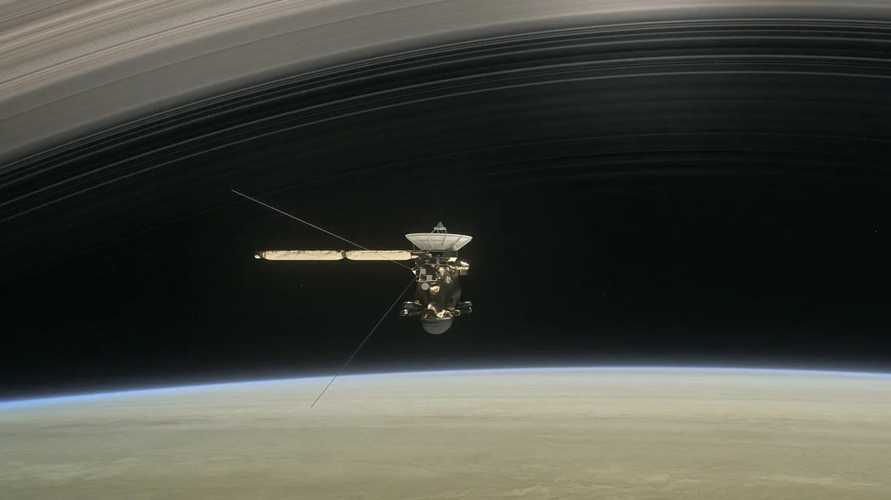
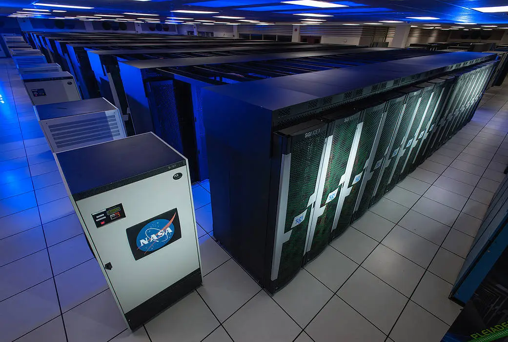

---
<!--
L'histoire de l'informatique est fortement liée à l'histoire de l'exploration spatiale.
-->

## 2.1. L'histoire conjointe de l'informatique et de la course à l'espace

 

  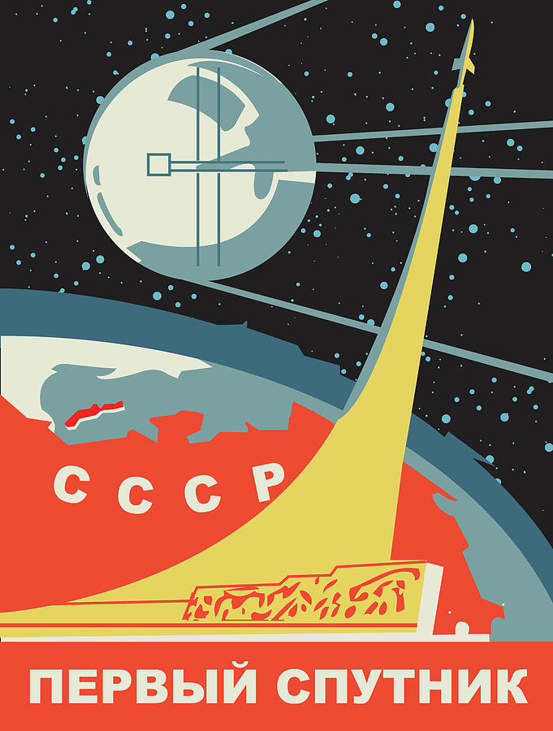
  
  

---
<!--
Depuis les premiers satellites jusqu'à aujourd'hui, l'informatique a toujours été au cœur de l'exploration spatiale.
Il faut savoir que n'importe quelle mission spatiale nécessite énormément de calculs pour fonctionner. 
-->

**Au sol :**
- Calculs de trajectoires
- Mécanique orbitale
- Communication

**En vol :**
- Dynamique de vol
- Navigation
- Correction de trajectoire
- Communication

---
<!--
Voici le missile balistique V2, qui a malheureusement été utilisé par la Wehrmacht pendant la Seconde Guerre mondiale. Mais c'est aussi le premier engin capable d'atteindre l'espace. On remonte donc aux prémisses de l'aérospatiale et voici l'équipement embarqué pour contrôler la fusée.
Ça n'est pas ce que je considère d'ordinateur, c'est simplement un ensemble de composants qui effectue les opérations mathématiques nécessaires avec des signaux électriques.
Si la fusée dérive de sa trajectoire, l'électronique va envoyer le signal électrique nécessaire pour corriger la trajectoire.
-->

### Fusée V2 (1944)

 

  
  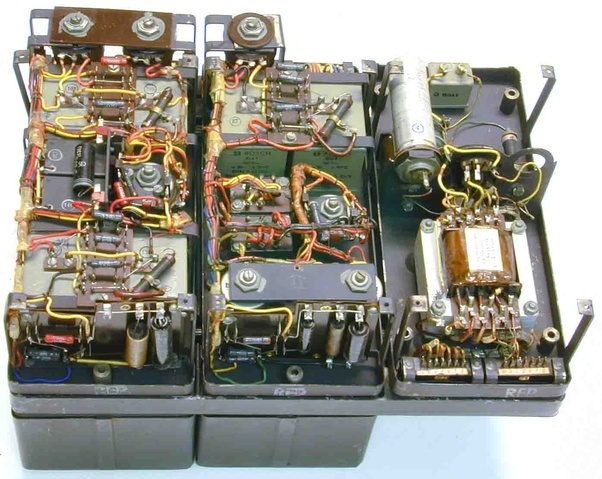

---
<!--
S'il y a une mission spatiale qui a profondément marqué l'histoire de l'informatique, c'est le programme Apollo : le programme qui a permis à l'homme de marcher sur la Lune.
Pour cette mission, on avait beaucoup plus de besoins et de contraintes parce que la vie de 3 astronautes était en jeu pendant plus de 8 jours.
-->

### Programme Apollo (1969)

 

  
  

---
<!--
Cet ordinateur est une révolution à plusieurs niveaux.
- Il est extrêmement compact. À son époque, des ordinateurs équivalents prenaient la taille d'une pièce entière.
- Son programme est stocké dans une mémoire magnétique de 32Ko. Un mail aujourd'hui pèse en moyenne 81Ko.
- Il est asynchrone. C'est-à-dire que pour se débrouiller avec le peu de ressources, Margaret Hamilton a dû inventer un système qui priorise les tâches en fonction de leur importance.
-->

### Apollo Guidance Computer (1969)

 

  

- Compact
- Programme de 32Ko
- Asynchrone

---

 
 
 
<iframe src="https://dev.matheo-galuba.com/embed/sync-vs-async" width="100%" height="100%" frameborder="0"></iframe>

---

---
<!--

-->

### Robotique spatiale

#### 1957 - Premier satellite artificiel

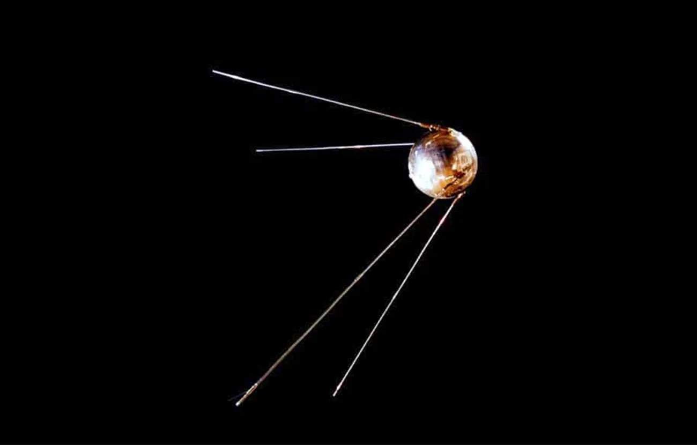

---

### Robotique spatiale

#### Années 60 – Atterrisseurs vers la Lune et Vénus

---

### Robotique spatiale

#### Années 70 – Sondes Voyager

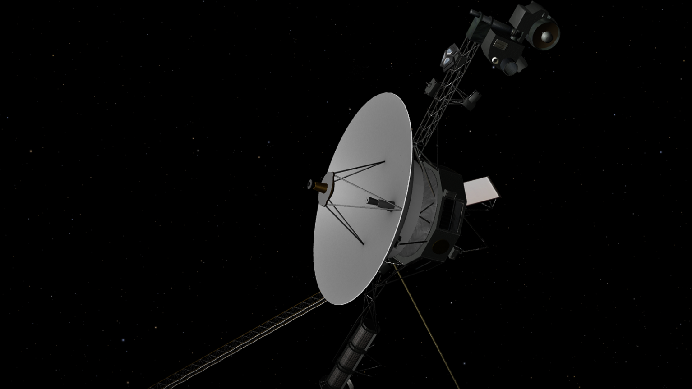

---

### Robotique spatiale

#### Années 80 - Navettes spatiales & robotisation de l'orbite terrestre

---

### Robotique spatiale

#### Années 90 - Exploration de Mars

---

### Robotique spatiale

#### Années 90 - Exploration de Mars

  <iframe src="https://dev.matheo-galuba.com/embed/mars-missions" width="70%" height="80%" frameborder="0"></iframe>

---

### Robotique spatiale

#### Années 2000 à aujourd'hui

- Visite de Saturne

---

### Robotique spatiale

#### Années 2000 à aujourd'hui

- Visite de Saturne
- Selfie sur Mars

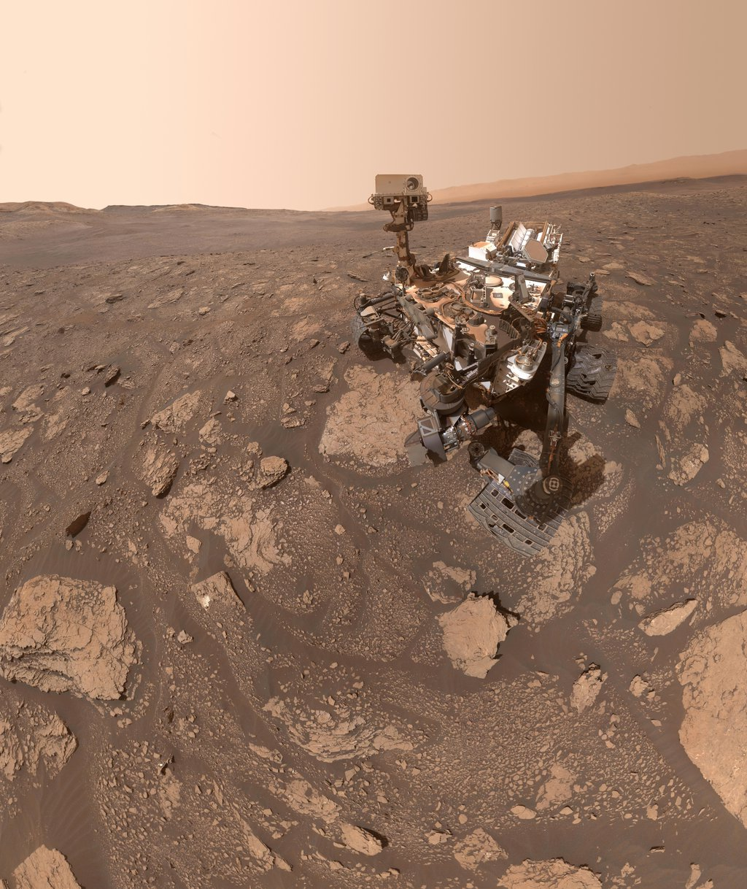

---

### Robotique spatiale

#### Années 2000 à aujourd'hui

- Visite de Saturne
- Selfie sur Mars
- Lanceurs réutilisables

---
<!-- _class: lead -->

**Aucun humain n'a quitté l'orbite basse terrestre depuis 1972.**
(dernière mission Apollo)

---

<!-- _footer: "Endurance (Interstellar)" -->

## 2.2. Perspectives futures

---

<!-- _footer: "Interieur de l'ISS (NASA)" -->

<!--
Pour envoyer et faire survivre des humains dans l'espace, c'est evidemment pas une mince affaire. Ca necessite bien sur enormement d'équipements, et ca coûte par conséquent très cher.
-->

---
<!--
A contrario, les machines, c'est beaucoup plus simple. Elles n'ont pas besoin d'air, de nourriture, d'eau, de sommeil, etc. Elles peuvent être exposées à des conditions extrêmes sans problème.
Prenons l'exemple de Voyager 2, lancé en 1977, qui est toujours en service après 47 ans, il est à 24 milliards de km de la Terre sans intervention humaine.
-->

 

  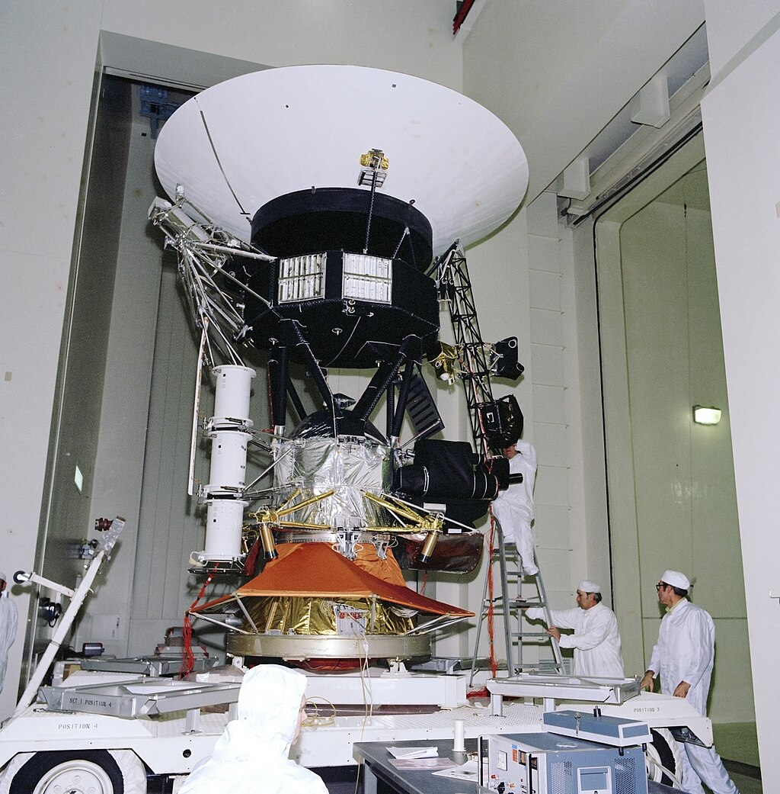
  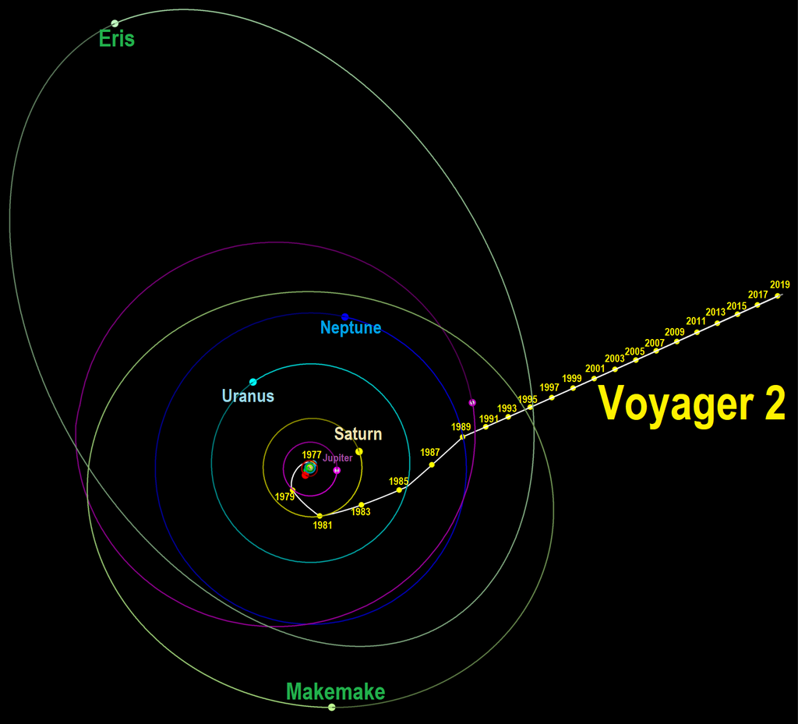

---
<!--
A côté de ca, il faut bien avouer que les humains sont beaucoup plus polyvalents et intelligents que les robots. Certe, on ne fait pas autant de calculs à la seconde, mais on est capable de prendre des décisions, de s'adapter à des nouvelles situations inattendues, etc.
-->

<svg xmlns="http://www.w3.org/2000/svg" xmlns:xlink="http://www.w3.org/1999/xlink" version="1.1" width="100%" viewBox="-0.5 -0.5 256 156" style="max-width:100%;max-height:600px;"><defs/><g><path d="M 7 147 L 7 13.37" fill="none" stroke="#cdd6f4" stroke-miterlimit="10" pointer-events="stroke"/><path d="M 7 8.12 L 10.5 15.12 L 7 13.37 L 3.5 15.12 Z" fill="#cdd6f4" stroke="#cdd6f4" stroke-miterlimit="10" pointer-events="all"/><path d="M 7 147 L 240.63 147" fill="none" stroke="#cdd6f4" stroke-miterlimit="10" pointer-events="stroke"/><path d="M 245.88 147 L 238.88 150.5 L 240.63 147 L 238.88 143.5 Z" fill="#cdd6f4" stroke="#cdd6f4" stroke-miterlimit="10" pointer-events="all"/><path d="M 7 107 L 37 97 L 77 107 L 127 87 L 157 97 L 207 87 L 247 97" fill="none" stroke="#f38ba8" stroke-miterlimit="10" pointer-events="stroke"/><rect x="47" y="87" width="5" height="60" fill="#89b4fa" stroke="none" pointer-events="all"/><rect x="67" y="57" width="5" height="90" fill="#89b4fa" stroke="none" pointer-events="all"/><rect x="117" y="97" width="5" height="50" fill="#89b4fa" stroke="none" pointer-events="all"/><rect x="187" y="27" width="5" height="120" fill="#89b4fa" stroke="none" pointer-events="all"/><rect x="147" y="87" width="5" height="60" fill="#89b4fa" stroke="none" pointer-events="all"/><rect x="107" y="117" width="5" height="30" fill="#89b4fa" stroke="none" pointer-events="all"/></g></svg>

---

<!-- _footer: "Robonaut 2 (NASA)" -->

<!--
Donc dans un futur relativement proche, il me parrait assez évident que l'exploration spatiale sera encore très robotisée. Et nous allons surement voir plus en plus collaboration entre humains et robots.
-->

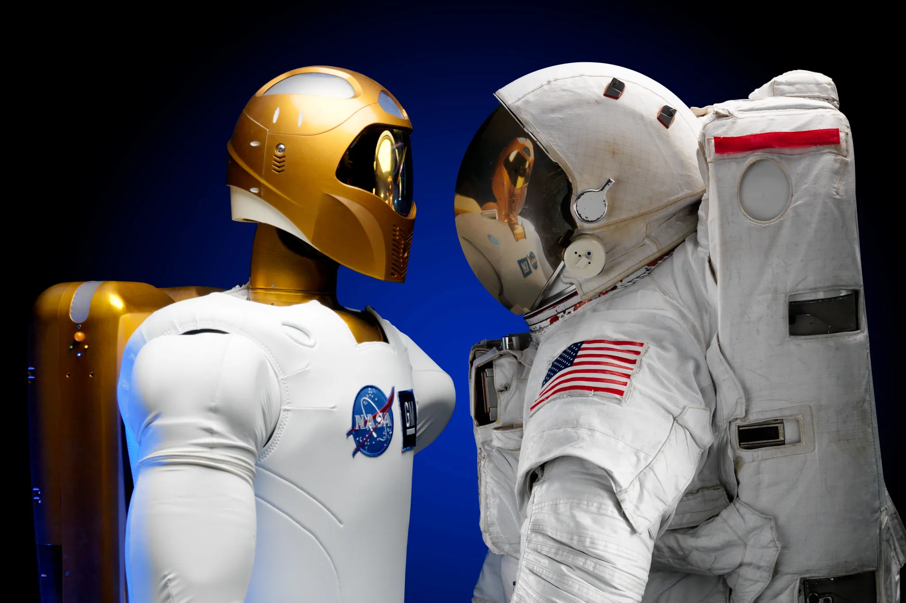

---

<!-- _footer: "Interstellar Vehicle Venture Star (Avatar)" -->

<!--
Par contre pour ce qui est du futur lointain, lorsque l'humanité aura envi de quitter le systeme solaire. Il est fort probable que les avancées en informatique permettront de créer des vaisseaux spatiaux autonomes, capables de voyager sur des distances astronomiques sans intervention humaine.
-->

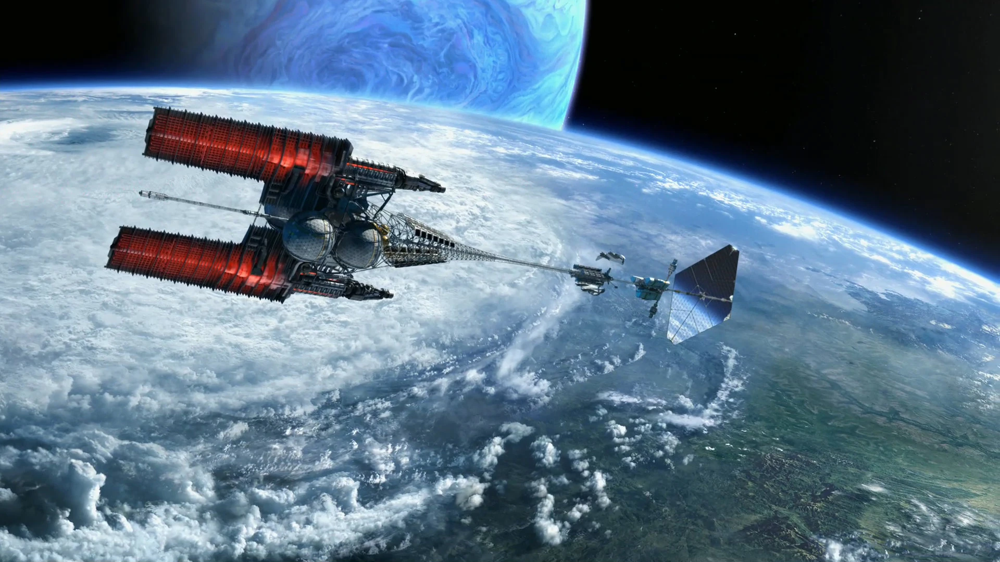

---
<!-- _class: lead -->

## Merci pour votre attention !

---
<!-- _class: lead -->

### Sources & infos pour aller plus loin

[https://dev.matheo-galuba.com/page/l-informatique-dans-la-conquete-spatiale-et-l-astronomie](https://dev.matheo-galuba.com/page/l-informatique-dans-la-conquete-spatiale-et-l-astronomie)

 

  
  
  
  

